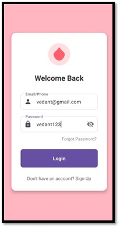
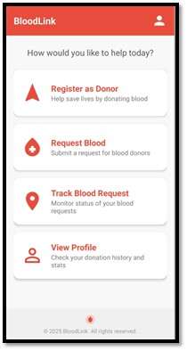
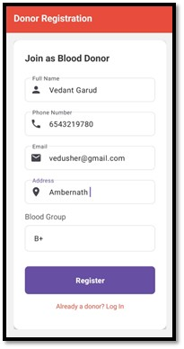
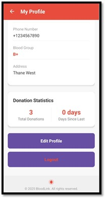
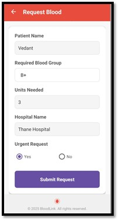
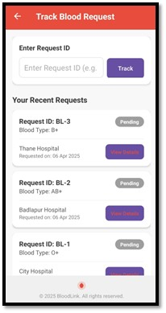
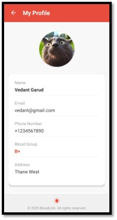

# 🩸 BloodLink – Blood Donation Mobile Application


**BloodLink** is an **Android mobile application** that connects **blood donors, patients, and hospitals** during emergency situations.

The app enables users to:

* Register as blood donors
* Request blood during emergencies
* Track blood requests
* Manage personal donor profiles

The goal of this project is to **simplify and accelerate the process of finding compatible blood donors**, improving communication and potentially saving lives.

---

# 📱 Application Screenshots

### 🔐 Login & Home

| Login Screen                           | Home Screen                             |
| -------------------------------------- | --------------------------------------- |
|  |  |

---

### 🧑‍⚕️ Donor Registration & Statistics

| Register Donor                              | Donor Statistics                                 |
| ------------------------------------------- | ------------------------------------------------ |
|  |  |

---

### 🩸 Blood Request & Tracking

| Request Blood                             | Track Request                           |
| ----------------------------------------- | --------------------------------------- |
|  |  |

---

### 👤 Profile Management

| Profile Screen                             |
| ------------------------------------------ |
|  |

---

# ✨ Features

## 🧑‍⚕️ Donor Registration

Users can register as blood donors by providing essential information such as:

* Full name
* Phone number
* Address
* Blood group

This information helps the system match donors with blood requests.

---

## 🩸 Blood Request System

Patients or hospitals can submit blood requests including:

* Patient name
* Required blood group
* Number of units needed
* Hospital name
* Urgency status

This enables fast communication between requesters and potential donors.

---

## 📊 Request Tracking

Users can monitor the **status of blood requests**, allowing them to track progress from **submission to fulfillment**.

---

## 👤 Profile Management

Users can view and manage:

* Personal information
* Blood group details
* Donation history

---

## 📱 User-Friendly Interface

The application provides a **clean and intuitive mobile interface** built using **Android XML layouts and components** for smooth navigation and usability.

---

# 🛠 Technologies Used

| Technology         | Purpose                      |
| ------------------ | ---------------------------- |
| **Java**           | Application logic            |
| **XML**            | UI design                    |
| **Android Studio** | Development environment      |
| **SQLite**         | Local database storage       |
| **Android SDK**    | Mobile application framework |

---

# 📂 Project Structure

```
BloodLink/
│
├── app/
│   ├── java/com/example/bloodlink/
│   │   ├── MainActivity.java
│   │   ├── RegisterActivity.java
│   │   ├── RequestActivity.java
│   │   ├── TrackRequestActivity.java
│   │   ├── ProfileActivity.java
│   │   ├── DatabaseHelper.java
│   │   ├── User.java
│   │   └── BloodRequest.java
│
│   ├── res/
│   │   ├── layout/
│   │   │   ├── activity_main.xml
│   │   │   ├── activity_register.xml
│   │   │   ├── activity_request.xml
│   │   │   ├── activity_track_request.xml
│   │   │   └── activity_profile.xml
│   │
│   │   ├── drawable/
│   │   └── values/
│
│   └── AndroidManifest.xml
│
├── screenshots/
│   ├── login.jpg
│   ├── register.jpg
│   ├── request.jpg
│   ├── track.jpg
│   ├── donor_stats.jpg
│   └── profile.jpg
│
└── README.md
```

---

# 🗄 Database Structure

The application uses **SQLite** to store users, donations, and blood requests.

---

## Users Table

| Field       | Description    |
| ----------- | -------------- |
| id          | User ID        |
| email_phone | Email or phone |
| password    | User password  |
| full_name   | Full name      |
| phone       | Contact number |
| address     | User address   |
| blood_group | Blood group    |

---

## Donations Table

| Field         | Description      |
| ------------- | ---------------- |
| id            | Donation ID      |
| user_id       | Donor ID         |
| donation_date | Date of donation |

---

## Blood Requests Table

| Field         | Description          |
| ------------- | -------------------- |
| id            | Request ID           |
| user_id       | Request creator      |
| patient_name  | Patient name         |
| blood_group   | Blood group required |
| units_needed  | Units required       |
| hospital_name | Hospital name        |
| is_urgent     | Urgency flag         |
| request_date  | Request timestamp    |
| status        | Request status       |

---

# ⚙️ How to Run the Project

## 1️⃣ Clone the Repository

```bash
git clone https://github.com/vedantgrd/blood-donate-v2
```

---

## 2️⃣ Open in Android Studio

1. Open **Android Studio**
2. Click **Open Project**
3. Select the **BloodLink folder**

---

## 3️⃣ Run the Application

1. Connect an **Android device** or start an **Android Emulator**
2. Click **Run ▶**
3. The application will install and launch on the device.

---

# 🎯 Skills Demonstrated

This project demonstrates the following skills:

* Android Application Development
* Mobile UI/UX Design
* SQLite Database Integration
* Data Validation
* Activity Navigation using Intents
* Database CRUD Operations
* Mobile Application Architecture

---

# 🚀 Future Improvements

Potential enhancements for future versions:

* Firebase Cloud Database Integration
* Real-time donor notifications
* Location-based donor search
* Hospital system integration
* Push notifications for urgent blood requests
* Donor availability status
* Google Maps integration for nearby donors

---
